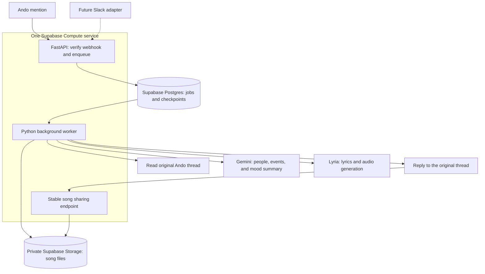

# Threadsong on Supabase Compute

Use Python 3.12 + uv in a Dockerfile-based **Compute service**. This restores the
original language preference while keeping hosting, database, and audio storage
in Supabase. No per-song sandbox or user-managed VM is required.

## Deployment shape

One public `threadsong` service, one 2 GB instance, one ASGI process, for the
initial tenant. FastAPI handles webhooks and sharing; an asyncio worker advances
durable jobs. Awaiting external APIs does not block the HTTP server.

The worker makes its calls sequentially; the diagram shows ownership and
integration boundaries. Google hosts the models. Supabase hosts our orchestration.

## Changes from the Edge Functions proposal

- No Edge Function timeout workaround, Cron polling, Layer account, or TS/Python split.
- Call Google's Lyria Interactions API directly. Keep an application deadline.
- Retain a durable Postgres queue: a long-lived process can still crash or restart.
- One `song_jobs` table is both queue and job record. No separate broker is needed.
  Claim with `FOR UPDATE SKIP LOCKED` and fenced leases; perform network I/O
  outside database transactions.
- HTTP acknowledgment means durably queued, not that the song is finished.

## Request lifecycle

1. Ando sends a signed `message.created` event to `POST /webhooks/ando`.
2. Verify the exact bytes and timestamp. Restrict workspace/channel access and
   ignore the agent's own messages.
3. Save IDs before returning HTTP 204. `(platform, workspace_id, message_id)`
   deduplicates logical requests across different webhook delivery IDs.
4. Fetch the message and confirm its mention token. Ignore unrelated messages.
   The webhook's `related.thread_root_message_id` supplies thread lineage, which
   the public message object itself omits.
5. Fetch bounded, paginated thread context. Exclude bot replies. Preserve the
   requester's instruction even if a long thread is truncated.
6. Acknowledge in-thread, summarize who did what and the intended mood in one or
   two sentences, then discard stored raw thread text. Preserve an explicitly
   requested style; do not invent one. Keep a short title for display only.
7. Send the summary, optional style, and target duration to Lyria, letting it write
   the lyrics and music. Checkpoint `generating` before the call. Upload the returned audio and
   checkpoint the object key and exact reply body.
8. Reply using `thread_root_id` and a stable Ando `Idempotency-Key`.
9. `/s/<random-token>` resolves a completed job and redirects to a five-minute
   signed Storage URL. Anyone with the stable sharing link can listen; it grants
   no access to the thread, credentials, or job table.

The MVP UI is the chat thread plus a browser-playable audio link. A TypeScript
frontend can later provide a song page, cover art, and a library.

## Recovery and boundaries

Read/draft/publish stages have bounded retries. Ando acknowledgments, results,
and failures use fixed message bodies and stable idempotency keys.

A timeout or restart during `generating` is an **unknown paid outcome**. Record
failure and request inspection instead of silently buying another generation.
If generated audio could not be saved, a new explicit request may be necessary.
There is no claim of exactly-once external execution.

Leases outlast the generation HTTP timeout plus upload/checkpoint allowance.
Expired workers cannot overwrite a new owner's checkpoint. Generation is serial
per worker initially. Postgres and Storage are durable; the Compute filesystem
is disposable. SQLite and local audio are only for the credential-free demo.

The job table has RLS and no anon/authenticated policies. The trusted backend
uses a server Postgres credential and a server-only Storage credential. Sharing
tokens are bearer capabilities; application access logs are disabled to avoid
recording them. Real workspace keys belong in runtime secrets, never the image.

## Slack extension

The `SongRequest`, `ThreadContext`, `Composer`, `SongStorage`, and `PlatformAdapter`
interfaces are platform-neutral. A Slack adapter adds signature verification,
event normalization, `context()`, and `reply()`. Slack uses `thread_ts`; Ando uses
`thread_root_id`. The worker, music provider, storage, and sharing are unchanged.
Slack is not yet wired up.

## Compute facts and remaining validation

CLI 2.119.0 accepts the Dockerfile runtime, public exposure, one instance, and
2 GB size. It rejects the repository root as a build source. The preparation
script stages source and manifests in `supabase/compute/threadsong/`, excluding
credentials and local data. Its generated starter documents plain HTTP on the
injected `PORT`; FastAPI binds `0.0.0.0:$PORT`. `compute push` builds remotely,
so local development needs uv, not a Docker daemon.

The Python container was deployed successfully, and Ando delivered a signed
test webhook to its public endpoint. Project secrets set with `supabase secrets
set` are injected by the Compute launcher; no secrets go into the image. Initial
deployment uses `APP_MODE=setup`, which accepts signed test events but does not
acknowledge song requests or run jobs. `/health` is the hosted health endpoint;
the gateway currently returns 404 for `/healthz`.

Before a hosted song demo, verify database/Storage access and completion of a
job after acknowledging HTTP. Confirm idle suspension does not strand queued
jobs and test restart recovery. The inspected CLI exposes an instance count,
but no verified keep-awake setting. See [deployment status](deployment.md).

For scale, split a public API (`RUN_WORKER=false`) from a private worker using
the same queue. Add a worker-only entrypoint then; today's entrypoint always
serves HTTP. Consider per-tenant deployments when isolation warrants it.

References: [Compute](https://supabase.com/compute),
[Ando webhooks](https://docs.ando.so/developers/webhooks),
[Ando API](https://docs.ando.so/developers/api-reference),
[Lyria](https://ai.google.dev/gemini-api/docs/music-generation).
